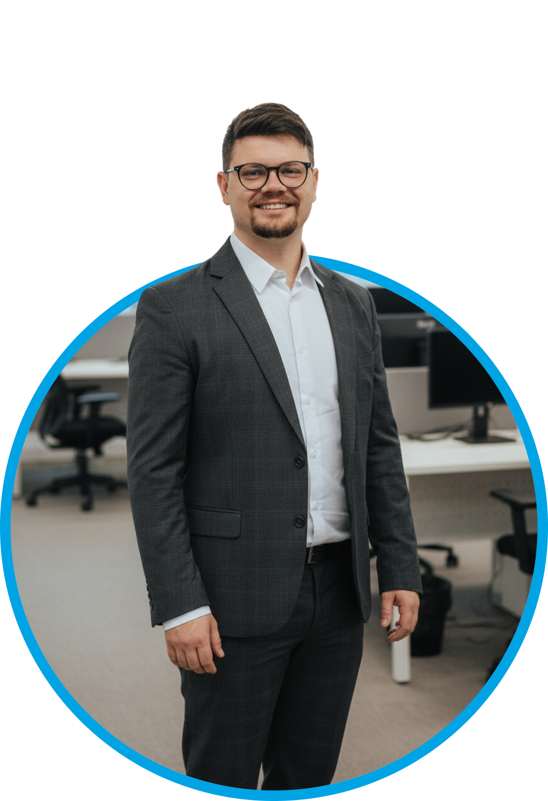

<!-- Animated Typing Header -->

 

<!-- Profile Photo -->

  

<!-- Tagline -->
**Brazilian Entrepreneur in Germany** | **5 Companies** | **6 Languages** | **AI & Software Expert**

 

---

## About Me

I'm a Brazilian entrepreneur who moved to Germany 7+ years ago and built multiple successful tech companies. I specialize in **AI solutions**, **software development**, and **data protection** — helping businesses automate and digitize their operations.

> *"Nothing is impossible! Everything is achievable and implementable!"*

---

## My Companies

<table>
<tr>
<td align="center" width="33%">

### [Melo Designer](https://melodesigner.de/)
**Software & AI Agency**

Web Development, Software Solutions, AI Automation, Voice Agents

*150+ Projects | Since 2019*

</td>
<td align="center" width="33%">

### [AmtHeld](https://amtheld.de/)
**AI for Government**

AI-powered telephone assistant for municipalities. 24/7 citizen support in 25+ languages.

*My proudest creation*

</td>
<td align="center" width="33%">

### [ePass Digital](https://epass-digital.de/)
**Emergency Planning**

Digital platform for advance care planning, emergency cards & document management.

*100% Made in Germany*

</td>
</tr>
</table>

<b>More Ventures</b>

 

| Company | Description |
|---------|-------------|
| [**EmpfehlerWerk**](https://www.empfehlerwerk.de/) | SaaS platform for automated referral marketing |
| [**DSB Melo**](https://datenschutzbeauftragter-melo.de/) | Data Protection Officer services (TÜV SÜD certified) |
| [**Gospel Tabs**](https://gospel-tabs.com/) | Ultimate Guitar for Christian music — my passion project |

---

## Current Focus

- **AmtHeld** — Revolutionizing government-citizen communication with AI
- **Data Protection** — Helping German businesses with GDPR compliance
- **AI in Healthcare** — Building intelligent software for doctors

---

## Tech Stack

**Frontend**

**Backend**

**Mobile & Database**

**AI & Tools**

---

## GitHub Stats

---

## Languages I Speak

| | Language | Level |
|:-:|----------|:-----:|
| 🇧🇷 | Portuguese | Native |
| 🇩🇪 | German | C2 |
| 🇬🇧 | English | C1 |
| 🇪🇸 | Spanish | C1 |
| 🇮🇹 | Italian | B1 |
| 🇸🇰 | Slovak | A2 |

---

<b>Beyond Code</b>

 

| | Hobby | Details |
|:-:|-------|---------|
| 🎸 | **Music** | Multi-instrumentalist: Guitar, Piano, Bass, Drums. Created [Gospel Tabs](https://gospel-tabs.com/) |
| 🤿 | **Diving** | SDI Divemaster — passionate about underwater exploration |
| 🚴 | **Cycling** | Road cyclist with my own race bike |

---

### Let's Connect

Open for **business collaborations** through [Melo Designer GmbH](https://melodesigner.de/)

 

